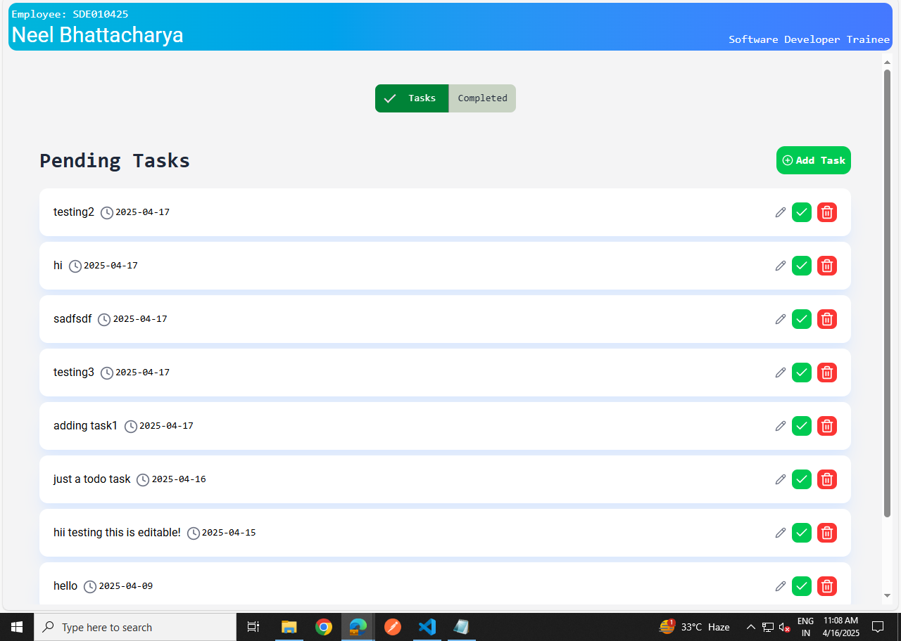
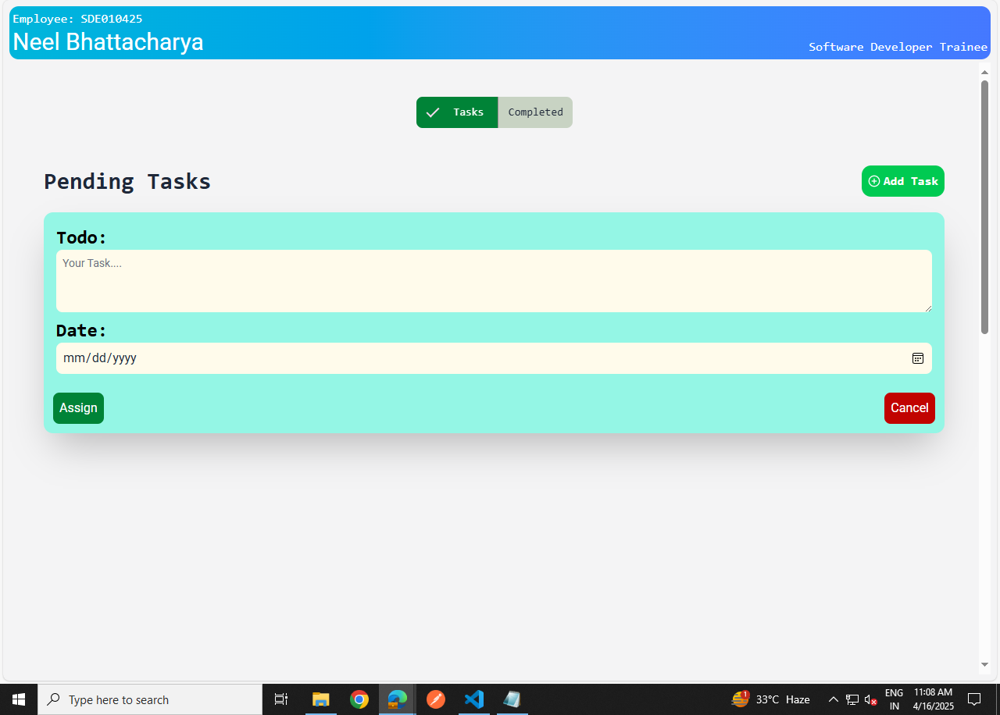
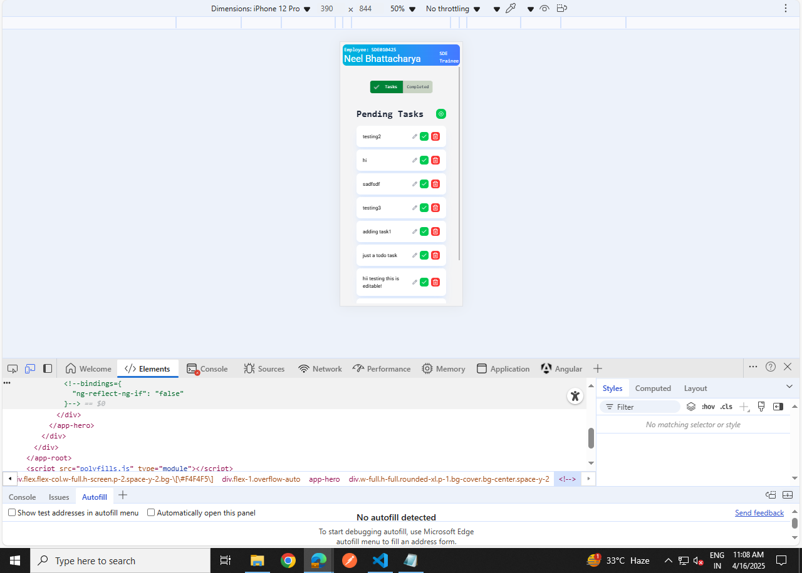

# TodoApp - Angular

This project was generated using [Angular CLI](https://github.com/angular/angular-cli) version 19.2.7.

## Go to the root folder 
```bash
npm i
```

## Development server

To start a local development server, run:

```bash
ng start
```

Once the server is running, open your browser and navigate to `http://localhost:4200/`. The application will automatically reload whenever you modify any of the source files.

## Running the backend(in json web server)
```bash
json-server --watch db.json --port 3000
```

## Images



